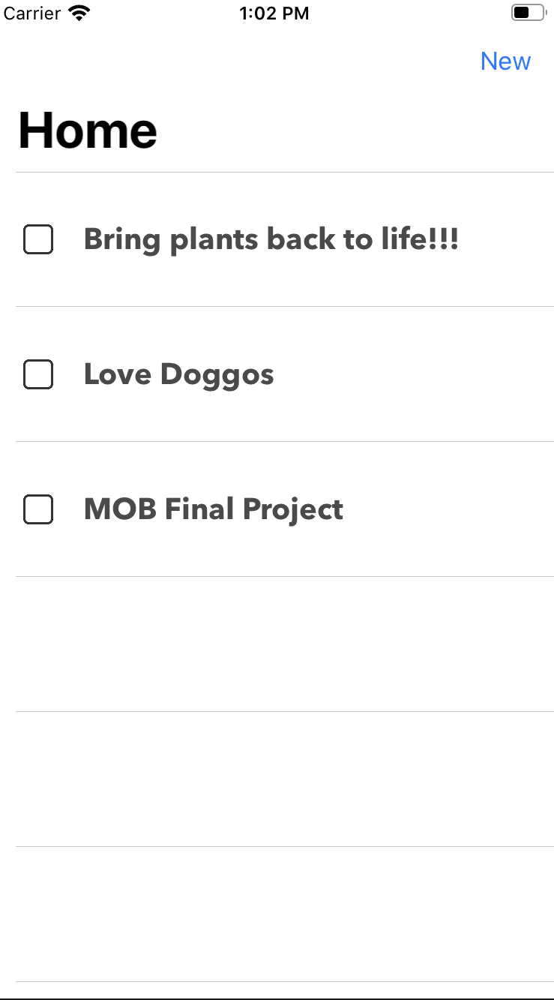
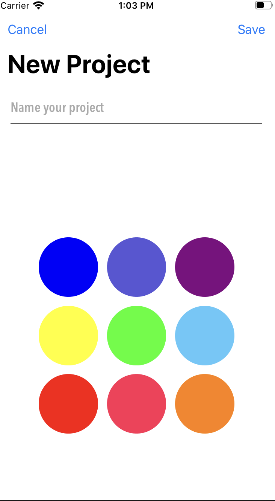
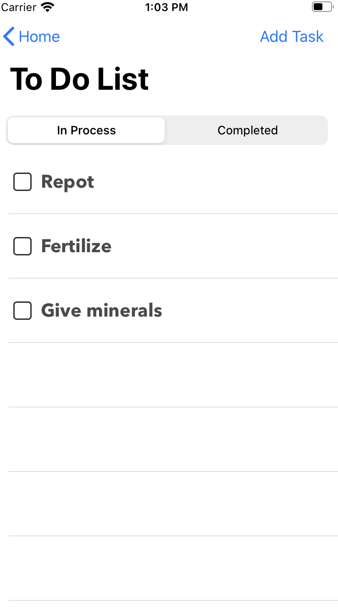
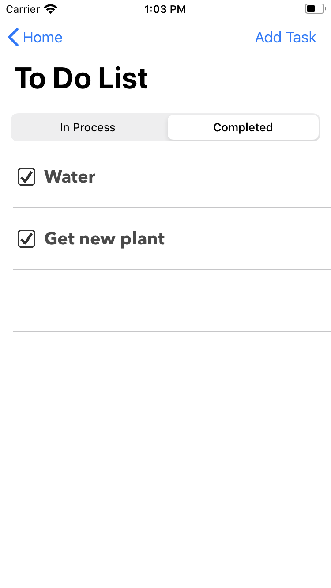
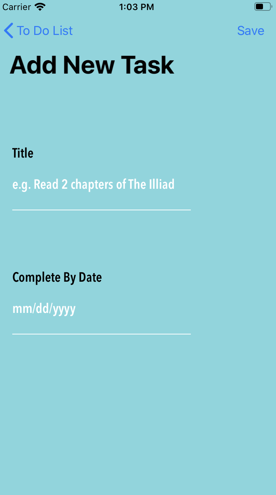

# Memini
iOS productivity app to manage projects, tasks, and other activities. By breaking down larger projects into smaller tasks, users can make gradual strides towards accomplishing their larger projects.

## Previews

### Home Screen | Adding Projects
When uers first open then the Memini app, they will see a list of their projects. Projects can be added by clicking the ```New``` button on the Home screen and then the ```Save``` button on the New Project page.

  

### Organize Tasks from the Project based on Status
After clicking on a project from the Home page, users will be able to see the tasks that are in progress and the tasks that have been completed based on the segment controller tab they are viewing. New tasks can be added by clicking the ```Add Task``` button on the To Do List page and then the ```Save``` button on the Add New Task page. 

   

Throughout the project and task items, users can swipe from right to left on the cell to view the edit and delete buttons. The edit button allows users to edit details of their project or task item and the delete button will remove all information of the project or task. 

## How to Install 
Note: Memini is still in the process of developmemt. Check back here to stay up to date with our team's development process. 

In order to preview this app, you will need to clone this repository and open it in Xcode
 - If you do not have Xcode you can download it [here](https://developer.apple.com/xcode/)

### Have an idea for a feature you'd like to see in Divvy? 
Feel free to send a message!

### Tech Stack 
- Swift
- SwiftUI 
- UIKit
- Xcode
